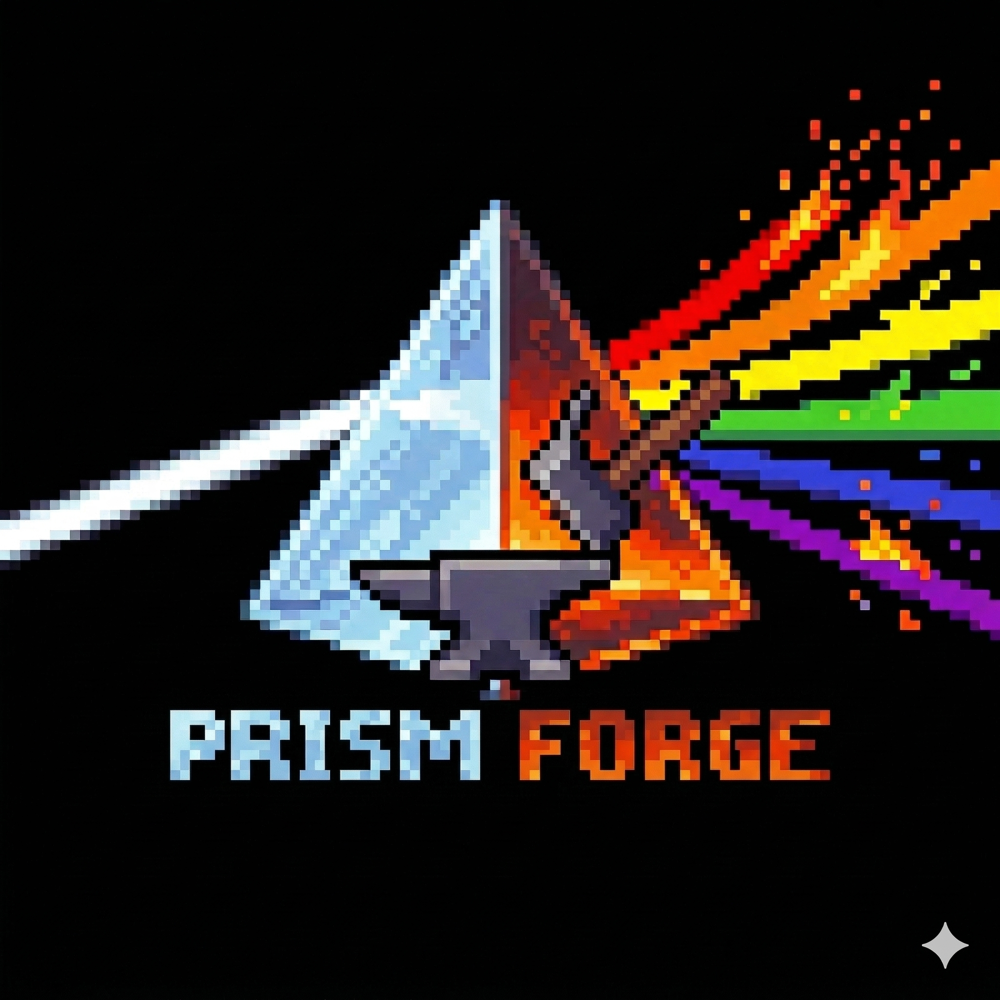

<p align="center">
  
</p>

<p align="center">
  <a href="https://www.npmjs.com/package/prism-forge"></a>
  <a href="https://opensource.org/licenses/MIT"></a>
  <a href="https://nodejs.org"></a>
  <a href="https://www.npmjs.com/package/prism-forge"></a>
</p>

<h3 align="center">Many minds. No menu.</h3>

PRISM Forge is a deterministic persona routing system for Claude Code. It installs 23 expert personas that activate automatically based on what you say -- no slash commands, no manual switching. Write naturally and the right expert responds.

## Why PRISM Forge?

**The problem:** AI coding assistants default to one voice. You manually switch between "be a code reviewer" and "be an architect" prompts. Context is lost between switches. You spend more time managing the AI than doing the work.

**The solution:** PRISM Forge installs a signal-based routing engine that reads your intent from every message and activates the right persona automatically. Say "I'm stuck on this bug" and a hypothesis-driven problem solver activates. Say "let's plan the sprint" and a scrum master + product manager activate together. No configuration required.

- **23 expert personas** covering analysis, architecture, development, QA, design, strategy, and more
- **Zero-config activation** -- install once, works immediately in every Claude Code session
- **Signal-based routing** -- personas activate based on what you say, not what you ask for
- **Dynamic orchestration** -- Susie (Chief of Staff) assembles the right persona team per context
- **Works with any Claude Code project** -- no per-project setup needed

## Quick Start

```bash
npx prism-forge install
```

That's it. Start a new Claude Code session and PRISM Forge is active.

Verify your installation:

```bash
npx prism-forge verify
```

Clean removal:

```bash
npx prism-forge uninstall
```

## How It Works

A single beam of light enters a prism and splits into a spectrum of expert perspectives. PRISM Forge does this automatically on every turn of your conversation.

**The routing flow:**

1. You send a message
2. Susie (the dynamic orchestrator) evaluates your intent
3. She classifies the domain and detects signal phrases
4. She assembles a persona team -- a primary expert plus relevant supporting perspectives
5. The response comes through the activated persona's lens

**Examples:**

> **You:** "I'm stuck on this auth bug -- tokens keep expiring early"
>
> **Dr. Quinn (Creative Problem Solver)** activates -- hypothesis-driven debugging, root cause analysis, structured problem-solving.

> **You:** "Let's plan the next sprint"
>
> **Bob (Scrum Master) + John (Product Manager)** activate together -- John challenges scope and business value first, then Bob structures the tasks.

> **You:** "Simplify this -- too many abstractions"
>
> **Jobs (Combinatorial Genius) + Musk (Radical Reductionist)** activate -- ruthless reduction from two angles: combinatorial synthesis and first-principles engineering.

**Shared signals** activate multiple personas simultaneously. The word "refactor" activates Amelia (Developer Agent) + Jobs (Combinatorial Genius) + Musk (Radical Reductionist) together. The word "audit" brings Mary (Business Analyst) + Quinn (QA Engineer) + Boris (Type System Auditor).

**War room:** Say "war room" and ALL personas activate for full-team analysis. Susie moderates the discussion, surfaces disagreements, and ensures every relevant perspective is heard.

For deeper technical details, see the [Architecture Guide](docs/architecture.md).

## Personas

### Always-On

Active every session, loaded via CLAUDE.md:

| Name | Role |
|------|------|
| Mary | Business Analyst |
| Amelia | Developer Agent |
| Bob | Scrum Master |
| Quinn | QA Engineer |

### Dynamic Orchestrator

| Name | Role |
|------|------|
| Susie | Chief of Staff / Dynamic Orchestrator |

### Specialists

Activate on signal -- loaded on-demand by Susie when needed:

| Name | Role |
|------|------|
| Winston | Architect |
| John | Product Manager |
| Paige | Technical Writer |
| Carson | Brainstorming Coach |
| Dr. Quinn | Creative Problem Solver |
| Maya | Design Thinking Coach |
| Victor | Innovation Strategist |
| Spike | Presentation Master |
| Sophia | Storyteller |
| Sally | UX Designer |
| Leonardo | Renaissance Polymath |
| Dali | Surrealist Provocateur |
| de Bono | Lateral Thinker |
| Campbell | Mythic Storyteller |
| Jobs | Combinatorial Genius |
| Barry | Quick Flow Solo Dev |
| Boris | Type System Auditor |
| Musk | Radical Reductionist |

## Documentation

- [Architecture Guide](docs/architecture.md) -- How the routing engine and persona system work
- [Signal Reference](docs/signals.md) -- Complete signal tables and routing behavior
- [Customization Guide](docs/customization.md) -- Creating your own personas
- [Contributing](CONTRIBUTING.md) -- How to contribute personas and code
- [Changelog](CHANGELOG.md) -- Version history

## Community and Support

- [GitHub Issues](https://github.com/prism-forge/prism-forge/issues) -- Bug reports and feature requests
- [GitHub Discussions](https://github.com/prism-forge/prism-forge/discussions) -- Questions and community conversation (will be enabled on the public repo)

## Contributing

PRISM Forge welcomes contributions -- especially new personas that fill domain gaps in the routing engine. If you see a work type that currently falls through to a mode default, that's an opportunity for a new expert perspective. See [CONTRIBUTING.md](CONTRIBUTING.md) for the full contribution guide, including the persona creation process and PR checklist.

## License

MIT License -- see [LICENSE](LICENSE) for details.

Copyright (c) 2025 BMad Code, LLC / Copyright (c) 2026 Anthony Hipp

## Credits

PRISM Forge is derived from [BMAD-METHOD](https://github.com/bmad-code-org/BMAD-METHOD), originally created by BMad Code, LLC and licensed under the MIT License. PRISM Forge is an independent project -- not affiliated with, endorsed by, or sponsored by BMad Code, LLC.

"BMad", "BMad Method", and "BMad Core" are trademarks of BMad Code, LLC. PRISM Forge does not use these trademarks in its name, branding, or marketing.
