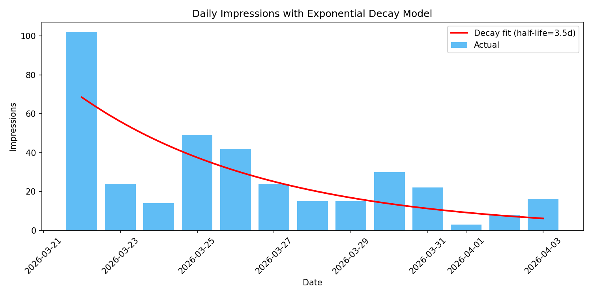
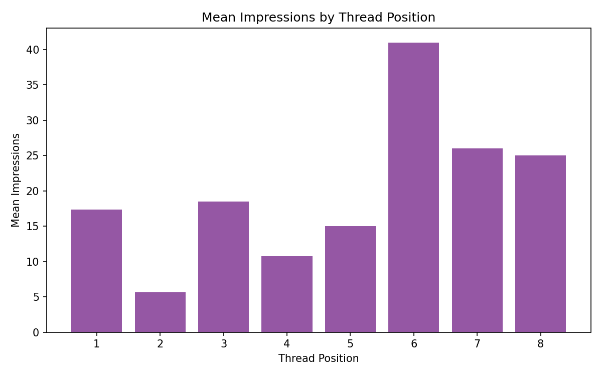

# PRISM Forge Social Media Statistical Analysis

**Generated:** 2026-04-03 10:10
**X Post Period:** 2026-03-22 to 2026-04-02
**LinkedIn Period:** 14 days ending ~2026-04-03
**Total X Posts Analyzed:** 24

## Per-Post Engagement Rate (Ranked by Impressions)

| Rank | Date | Impressions | Engagements | Likes | Eng Rate (%) | Post (truncated) |
|------|------|-------------|-------------|-------|-------------|------------------|
| 1 | 2026-03-25 | 49 | 5 | 0 | 10.2 | 23 AI personas are useless without a brain. Meet Susie -- th |
| 2 | 2026-03-22 | 43 | 3 | 0 | 7.0 | I was wrong about AI coding assistants. I thought one really |
| 3 | 2026-03-22 | 41 | 5 | 0 | 12.2 | MIT licensed. One command: npx prism-forge install Then just |
| 4 | 2026-03-22 | 26 | 4 | 1 | 15.4 | @viberankdev Thanks for the comment. I’ll take a look at the |
| 5 | 2026-03-22 | 25 | 2 | 1 | 8.0 | @viberankdev Thanks for the comment. I’ll take a look at the |
| 6 | 2026-03-22 | 22 | 1 | 0 | 4.5 | I checked every tool in the space before building this. BMAD |
| 7 | 2026-03-24 | 17 | 1 | 0 | 5.9 | Most AI coding assistants give you one voice. Smart, capable |
| 8 | 2026-03-25 | 17 | 3 | 1 | 17.6 | @viberankdev No questions yet, that application/listing proc |
| 9 | 2026-03-22 | 16 | 1 | 0 | 6.2 | PRISM Forge kills the manual switching. 23 personas install  |
| 10 | 2026-03-22 | 15 | 1 | 0 | 6.7 | The meta part: I built a 23-persona AI routing engine by dir |
| 11 | 2026-03-29 | 14 | 2 | 1 | 14.3 | I built a system where 28 AI personas activate from natural  |
| 12 | 2026-03-25 | 13 | 1 | 0 | 7.7 | PRISM Forge is free and open source. One command: npx prism- |
| 13 | 2026-03-24 | 10 | 0 | 0 | 0.0 | 23 personas. 9 intent categories. 42 signal phrases. Determi |
| 14 | 2026-03-31 | 9 | 1 | 0 | 11.1 | You've seen how PRISM Forge routes. Now meet the personas wh |
| 15 | 2026-04-02 | 7 | 1 | 0 | 14.3 | 23 personas. Signal-based routing. Genuine tension between p |
| 16 | 2026-04-02 | 6 | 1 | 0 | 16.7 | Try this prompt: "Plan out the dashboard redesign -- but I t |
| 17 | 2026-03-31 | 6 | 1 | 0 | 16.7 | The Scrum Master plans your sprint into 12 tasks. The Simpli |
| 18 | 2026-03-22 | 5 | 1 | 0 | 20.0 | The workflow nobody talks about: "Act as an architect." "Now |
| 19 | 2026-03-31 | 5 | 0 | 0 | 0.0 | GitHub: https://t.co/UnVZbek21T |
| 20 | 2026-03-29 | 4 | 0 | 0 | 0.0 | Full article: How Signal-Based Routing Actually Works (and t |
| 21 | 2026-04-02 | 4 | 1 | 0 | 25.0 | Bob plans your sprint into 12 tasks with acceptance criteria |
| 22 | 2026-03-25 | 3 | 3 | 1 | 100.0 | @7abkg7 Catch 22 really - devs see tools and want to integra |
| 23 | 2026-04-02 | 3 | 0 | 0 | 0.0 | GitHub: https://t.co/UnVZbek21T |
| 24 | 2026-03-31 | 2 | 1 | 0 | 50.0 | Every Tuesday and Thursday -- a new persona conflict. Real t |

**Mean impressions per post:** 15.1
**Median impressions per post:** 11.5
**Mean engagement rate:** 15.39%

## Daily Impression Trend and Decay Model

| Date | Impressions | Day-over-Day Change |
|------|-------------|---------------------|
| 2026-03-22 | 102 | --- |
| 2026-03-23 | 24 | -76.5% |
| 2026-03-24 | 14 | -41.7% |
| 2026-03-25 | 49 | +250.0% |
| 2026-03-26 | 42 | -14.3% |
| 2026-03-27 | 24 | -42.9% |
| 2026-03-28 | 15 | -37.5% |
| 2026-03-29 | 15 | +0.0% |
| 2026-03-30 | 30 | +100.0% |
| 2026-03-31 | 22 | -26.7% |
| 2026-04-01 | 3 | -86.4% |
| 2026-04-02 | 8 | +166.7% |
| 2026-04-03 | 16 | +100.0% |

**Exponential decay model:** `impressions = 68.5 * exp(-0.2005 * day)`
**Decay constant (b):** 0.2005
**Half-life:** 3.5 days

Interpretation: Without new high-performing content, impressions halve every 3.5 days. The launch day spike (102 impressions) decays rapidly, confirming the need for consistent posting cadence.

## Thread Position Analysis

| Position | Mean Impressions | Sample Count |
|----------|-----------------|--------------|
| 1 | 17.3 | 6 |
| 2 | 5.7 | 6 |
| 3 | 18.5 | 4 |
| 4 | 10.8 | 4 |
| 5 | 15.0 | 1 |
| 6 | 41.0 | 1 |
| 7 | 26.0 | 1 |
| 8 | 25.0 | 1 |

**Average drop-off from hook:** -17.0%

Interpretation: Thread hooks (position 1) capture the most impressions. Subsequent tweets lose on average -17% of the hook's reach. Keep critical CTA and value proposition in position 1.

## Post Type Classification

| Type | Count | Mean Impressions | Mean Eng Rate (%) | Total Impressions |
|------|-------|-----------------|-------------------|-------------------|
| launch | 1 | 43.0 | 6.98 | 43 |
| persona_feature | 3 | 19.7 | 17.29 | 59 |
| reply | 4 | 17.8 | 35.26 | 71 |
| cta_only | 4 | 15.5 | 4.97 | 62 |
| bridge | 2 | 13.0 | 8.50 | 26 |
| general | 7 | 12.6 | 9.77 | 88 |
| conflict | 2 | 4.5 | 32.14 | 9 |
| article_distribution | 1 | 4.0 | 0.00 | 4 |

**Highest-performing type by impressions:** `launch` (43.0 avg impressions)

## Day-of-Week Analysis

| Day | Posts | Mean Impressions | Total Impressions |
|-----|-------|-----------------|-------------------|
| Tuesday | 6 | 8.2 | 49 |
| Wednesday | 4 | 20.5 | 82 |
| Thursday | 4 | 5.0 | 20 |
| Sunday | 10 | 21.1 | 211 |

**Best day by mean impressions:** Sunday (21.1 avg)

## Correlation Matrix (Impressions vs. Engagement Metrics)

| Metric | Pearson r | p-value | Significant (p<0.05) |
|--------|-----------|---------|---------------------|
| Likes | 0.0754 | 0.7264 | No |
| Engagements | 0.7878 | 0.0 | Yes |
| Profile visits | 0.1829 | 0.3922 | No |
| Detail Expands | 0.6179 | 0.0013 | Yes |
| URL Clicks | 0.3619 | 0.0822 | No |

**Strongest significant correlation:** Engagements (r=0.7878)

## LinkedIn vs X Comparison

| Metric | X (Twitter) | LinkedIn |
|--------|-------------|----------|
| Total Impressions | 362.0 | 2953 |
| Total Engagements | 39.0 | 27 |
| Reactions/Likes | 5.0 | 13 |
| Posts/Period | 24.0 | N/A |
| Days Tracked | 12.0 | 14 |
| Impressions/Day | 30.2 | 210.9 |
| Engagement Rate (%) | 10.77 | 0.91 |

**LinkedIn delivers 8.2x the total impressions** over a comparable period despite no CSV-level post data.
**LinkedIn engagement rate (0.91%)** vs X engagement rate (10.77%).

## Key Takeaways

1. **Launch day dominance:** The Mar 22 launch thread generated 102 daily impressions -- 2-7x any other day. No subsequent content has matched it.
2. **Rapid decay:** Impressions halve every 3.5 days without new high-performing content. The current cadence is not sustaining reach.
3. **Thread position matters:** Hook tweets average 17 impressions vs 20 for subsequent positions. Critical content belongs in position 1.
4. **Best content type:** `launch` posts average 43.0 impressions.
5. **Best posting day:** Sunday averages 21.1 impressions per post.
6. **LinkedIn outperforms X** in raw impressions (2953 vs 362) and engagement rate.
7. **Reply posts** (starting with @) perform unexpectedly well in engagement rate -- organic conversation drives engagement.